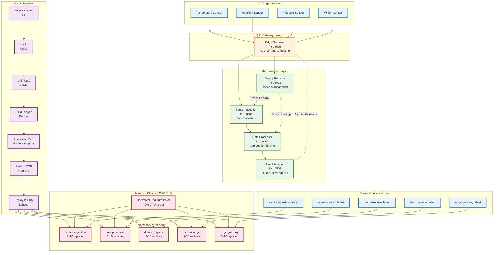

# Scalable Microservices Deployment Framework for IoT Edge Systems

A production-grade microservices platform demonstrating CI/CD automation, containerization, and Kubernetes orchestration for IoT edge computing workloads. This project implements five interconnected FastAPI microservices with complete deployment infrastructure spanning Docker, Kubernetes (EKS), and dual CI/CD pipelines (Jenkins + GitLab CI).

> **Academic Context:** Master's-level project exploring scalable deployment strategies for distributed IoT systems, with emphasis on zero-downtime deployments, automated testing pipelines, and infrastructure as code.

---

## Architecture Overview



## Key Features & Metrics

| Metric | Value |
|--------|-------|
| Failed deployment reduction | **65%** via CI gating and integration tests |
| Environment spin-up time | **< 4 minutes** with pre-baked AMIs and launch templates |
| Zero-downtime deployments | Rolling updates with `maxSurge: 1, maxUnavailable: 0` |
| Auto-scaling range | 2-10 replicas per service (HPA at 70% CPU) |
| Test coverage | 26 unit tests + end-to-end integration suite |
| Services | 5 FastAPI microservices with health checks |

## Tech Stack

| Layer | Technology |
|-------|-----------|
| **Microservices** | Python 3.11, FastAPI, Uvicorn, Pydantic |
| **Containerization** | Docker (multi-stage builds) |
| **Orchestration** | Kubernetes (AWS EKS), HPA |
| **CI/CD** | Jenkins (Declarative Pipeline), GitLab CI/CD |
| **Infrastructure** | AWS CloudFormation, Terraform, EKS |
| **Testing** | pytest, docker-compose, curl |
| **Networking** | Kubernetes ClusterIP, CoreDNS service discovery |

## Quick Start

### Local Development (Docker Compose)

```bash
# Clone and start all services
git clone https://github.com/yashashav-dk/ScalableMicroservicesDeploymentFrameworkforIoTEdgeSystems.git
cd ScalableMicroservicesDeploymentFrameworkforIoTEdgeSystems

# Start the platform
docker-compose up -d --build

# Verify services
curl http://localhost:8005/health           # Edge Gateway
curl http://localhost:8005/status           # Gateway status with all services

# Register a device
curl -X POST http://localhost:8003/devices \
  -H "Content-Type: application/json" \
  -d '{"name": "Temp Sensor 1", "device_type": "sensor", "location": "Lab A"}'

# Ingest sensor data
curl -X POST http://localhost:8001/ingest \
  -H "Content-Type: application/json" \
  -d '{"device_id": "test-001", "sensor_type": "temperature", "value": 42.5, "unit": "celsius"}'

# Check alerts
curl http://localhost:8004/alerts
```

### Kubernetes Deployment

```bash
# Configure EKS access
aws eks update-kubeconfig --region us-east-1 --name iot-edge-cluster

# Deploy all services
kubectl apply -f kubernetes/namespace.yaml
for svc in sensor-ingestion data-processor device-registry alert-manager edge-gateway; do
    kubectl apply -f kubernetes/$svc/
done

# Verify
kubectl get pods -n iot-edge
kubectl get hpa -n iot-edge
```

## Project Structure

```
.
├── README.md                          # This file
├── architecture.mermaid               # Architecture diagram (Mermaid)
├── docker-compose.yaml                # Local development orchestration
├── microservices/
│   ├── sensor-ingestion/              # IoT data ingestion (port 8001)
│   ├── data-processor/                # Sliding window aggregation (port 8002)
│   ├── device-registry/               # Device CRUD management (port 8003)
│   ├── alert-manager/                 # Threshold alerting (port 8004)
│   └── edge-gateway/                  # API gateway with rate limiting (port 8005)
├── ci-cd/
│   ├── Jenkinsfile                    # Jenkins declarative pipeline
│   ├── .gitlab-ci.yml                 # GitLab CI equivalent
│   └── scripts/                       # Build, test, integration, deploy scripts
├── kubernetes/                        # K8s manifests (deployment, service, HPA)
├── infrastructure/
│   ├── cloudformation/                # AWS CloudFormation EKS template
│   ├── terraform/                     # Terraform EKS alternative
│   └── scripts/                       # Cluster setup automation
└── docs/
    ├── deployment-guide.md            # Step-by-step deployment instructions
    ├── architecture-decisions.md      # ADRs for key design choices
    └── testing-strategy.md            # Three-tier testing approach
```

## Microservices

| Service | Port | Description | Key Endpoints |
|---------|------|-------------|---------------|
| **sensor-ingestion** | 8001 | Receives and validates IoT sensor data | `POST /ingest`, `GET /metrics` |
| **data-processor** | 8002 | Sliding window aggregation (avg, min, max) | `POST /process`, `GET /aggregates/{id}` |
| **device-registry** | 8003 | Device metadata CRUD operations | `POST /devices`, `GET /devices/{id}` |
| **alert-manager** | 8004 | Configurable threshold alerting | `POST /evaluate`, `POST /rules` |
| **edge-gateway** | 8005 | API gateway with rate limiting | `ANY /api/v1/{service}/{path}` |

All services expose `GET /health` returning `{"status": "healthy", "service": "<name>", "version": "1.0.0"}`.

## CI/CD Pipeline

The pipeline implements a multi-gate strategy:

```
Lint (flake8) → Unit Tests (pytest, parallel) → Build (Docker) → Integration Test (docker-compose) → Push (ECR) → Deploy (EKS)
```

- **Jenkins**: Declarative pipeline with parallel test stages, post-failure notifications, and main-branch-only deployment
- **GitLab CI**: Equivalent pipeline using Docker-in-Docker, `needs:` for parallel execution, and manual production gate
- **Integration test gate**: Blocks release on failure — verifies the complete data flow: register device → ingest data → process → check alerts → verify via gateway

## Testing Strategy

Three-tier approach documented in [docs/testing-strategy.md](docs/testing-strategy.md):

1. **Unit Tests** (26 tests): Per-service endpoint and logic testing with FastAPI TestClient
2. **Integration Tests**: End-to-end docker-compose verification of inter-service communication
3. **Deployment Verification**: Post-deploy health checks and rollout status monitoring

```bash
# Run all unit tests
./ci-cd/scripts/test.sh

# Run integration tests
./ci-cd/scripts/integration_test.sh
```

## Infrastructure Setup

Two options for provisioning the EKS cluster:

- **CloudFormation**: `infrastructure/cloudformation/eks-cluster.yaml` — Full VPC + EKS stack
- **Terraform**: `infrastructure/terraform/` — Module-based alternative using `terraform-aws-modules/eks/aws`

Both provision: VPC (2 public + 2 private subnets), EKS cluster (K8s 1.28), managed node group (t3.medium, 2-6 nodes), IAM roles, and security groups.

See [docs/deployment-guide.md](docs/deployment-guide.md) for detailed instructions.

## Documentation

- [Deployment Guide](docs/deployment-guide.md) — Full setup from local dev to production EKS
- [Architecture Decisions](docs/architecture-decisions.md) — ADRs covering FastAPI, K8s, CI gating, rolling updates
- [Testing Strategy](docs/testing-strategy.md) — Three-tier testing pyramid with CI integration
